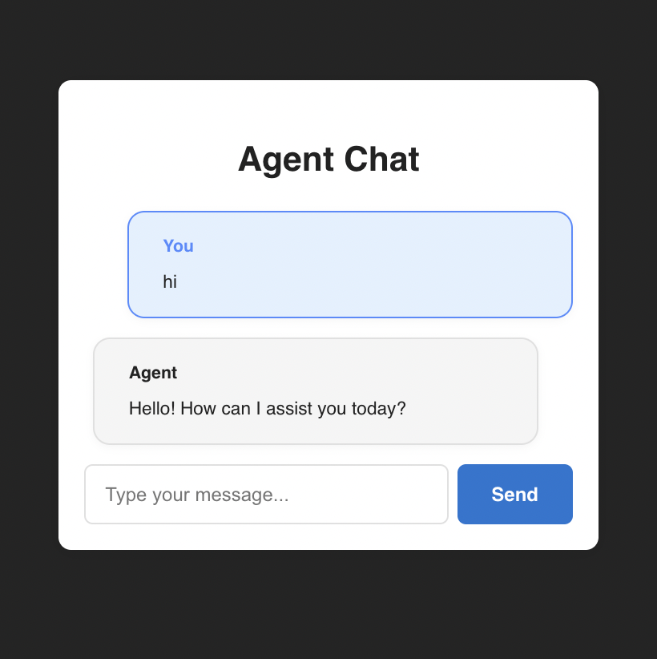

# Soup Agent: AI-Powered News Summarizer & Chat

Soup Agent is an end-to-end AI agent platform that combines Django (backend), React (frontend), and langgraph (agent orchestration) to provide:
- **Conversational chat with an LLM (OpenAI, Hugging Face, etc.)**
- **Automated news summarization for any country** using real-time scraping and summarization tools
- **Transparent tool trace and source links** for every agent response

---

## Features
- 🌍 **Ask for news highlights from any country** in natural language
- 🤖 **Small talk and general chat** with an LLM
- 🛠️ **Agent workflow with tool calls** (LLM-powered search, scraping, summarization)
- 🔗 **Source links** and **tool trace** for transparency
- 🖥️ **Modern, beautiful React UI** (see screenshots below)

---

## Screenshots

### News Highlights Example


### Small Talk Example


### Full UI Sample


---

## Setup Instructions

### 1. Clone the repo
```sh
git clone <your-repo-url>
cd Soup_Agent
```

### 2. Python Backend Setup
- Create and activate a virtual environment:
  ```sh
  python3 -m venv .venv
  source .venv/bin/activate
  ```
- Install dependencies:
  ```sh
  uv sync
  ```
- Add your API keys to a `.env` file:
  ```sh
  HUGGINGFACE_API_TOKEN=your_hf_token
  OPENAI_API_KEY=your_openai_key
  ```
- Run migrations and start Django:
  ```sh
  python manage.py migrate
  python manage.py runserver
  ```

### 3. Frontend Setup
- Go to the frontend directory:
  ```sh
  cd frontend
  pnpm install
  pnpm dev
  ```
- Open [http://localhost:5173](http://localhost:5173) in your browser.

---

## Usage
- **Chat**: Type any message for small talk or general questions.
- **News**: Ask for news highlights from any country (e.g., "What is the news in France today?").
- **See sources and tool trace**: Every agent response includes clickable news sources and a collapsible tool trace for transparency.

---

## Tech Stack
- **Backend**: Django, langgraph, OpenAI/Hugging Face, BeautifulSoup, requests
- **Frontend**: React (Vite + TypeScript), modern CSS-in-JS
- **Agent Orchestration**: LLM-driven intent detection, tool routing, and trace

